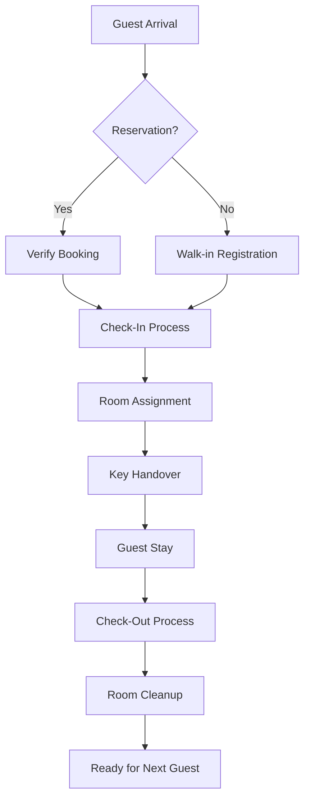
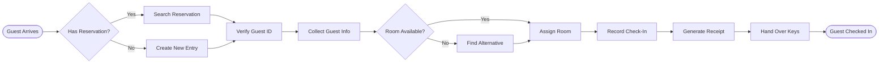
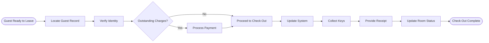
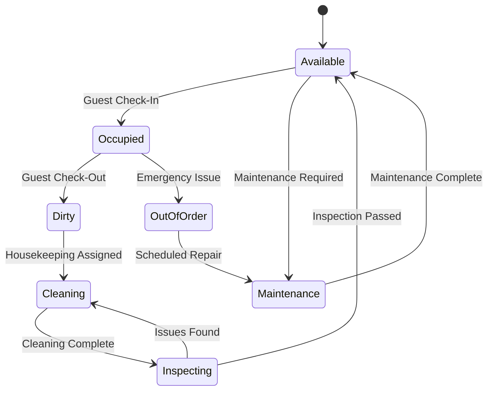
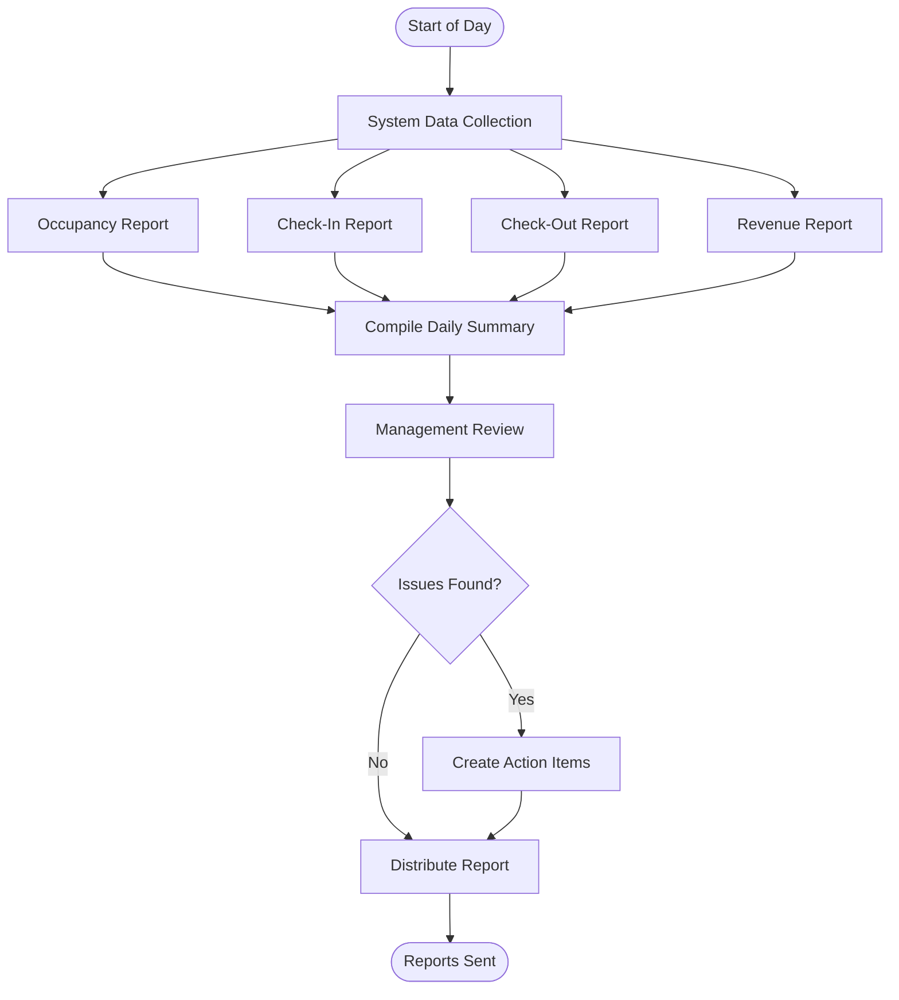
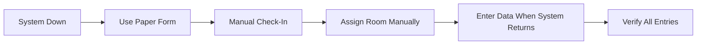
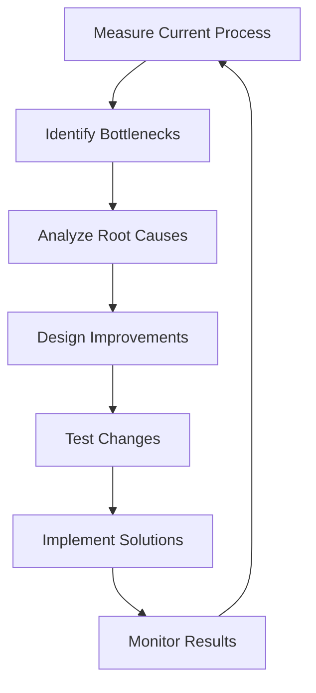

# Business Process Flows

## PVT Hostel Guest Management Processes

This document outlines the detailed business processes for guest management at PVT Hostel, including current and improved workflows.

## Table of Contents

1. [Process Overview](#process-overview)
2. [Guest Check-In Process](#guest-check-in-process)
3. [Guest Check-Out Process](#guest-check-out-process)
4. [Room Management Process](#room-management-process)
5. [Reporting Process](#reporting-process)
6. [Exception Handling](#exception-handling)
7. [Process Metrics](#process-metrics)

## Process Overview

### Core Business Processes

### Process Categories

1. **Guest-Facing Processes**
   - Check-in
   - Check-out
   - Room changes
   - Service requests

2. **Administrative Processes**
   - Reporting
   - Data management
   - Audit compliance
   - Staff scheduling

3. **Operational Processes**
   - Room management
   - Inventory tracking
   - Maintenance coordination
   - Security procedures

## Guest Check-In Process

### Process Name: Guest Check-In
**Process ID:** PR-001  
**Process Owner:** Front Desk Manager  
**Last Updated:** January 2025

### Process Flow Diagram

### Detailed Steps

#### 1. Guest Arrival (0-30 seconds)
**Responsible:** Front Desk Ambassador  
**Actions:**
- Greet guest warmly
- Ask for reservation details or ID
- Open check-in system

**Tools:** Computer with check-in system

#### 2. Reservation Verification (30-60 seconds)
**Responsible:** Front Desk Ambassador  
**Actions:**
- Search by name, email, or booking number
- Verify guest identity with ID
- Confirm booking details

**Decision Point:** Has reservation?
- Yes → Proceed with verification
- No → Create walk-in registration

#### 3. Information Collection (1-2 minutes)
**Responsible:** Front Desk Ambassador  
**Actions:**
- Enter/verify guest details:
  - Full name
  - ID/Passport number
  - Contact information
  - Emergency contact
- Confirm stay dates
- Note special requests

**Validation:** All required fields must be completed

#### 4. Room Assignment (30 seconds)
**Responsible:** System/Ambassador  
**Actions:**
- Check room availability
- Select appropriate room based on:
  - Guest preference
  - Booking type
  - Availability
- Confirm room assignment

**Exception:** If preferred room unavailable, offer alternatives

#### 5. Payment Processing (Optional, 1-2 minutes)
**Responsible:** Front Desk Ambassador  
**Actions:**
- Verify payment method
- Process payment/deposit
- Record transaction
- Provide receipt

**Note:** May be handled separately for pre-paid bookings

#### 6. Check-In Completion (30 seconds)
**Responsible:** Front Desk Ambassador  
**Actions:**
- Save guest record
- Print/email confirmation
- Prepare room key
- Provide hostel information

**Output:** Guest record created, room assigned

#### 7. Key Handover (30 seconds)
**Responsible:** Front Desk Ambassador  
**Actions:**
- Hand over room key
- Explain key usage
- Provide directions to room
- Offer assistance with luggage

**Completion:** Guest proceeds to room

### Process Variations

#### Walk-In Guest
1. No reservation verification needed
2. Check availability first
3. Negotiate rate if needed
4. Proceed with standard check-in

#### Group Check-In
1. Designate group leader
2. Collect all IDs
3. Batch process registrations
4. Distribute keys together

#### Late Night Check-In
1. Verify late arrival notification
2. Use simplified process
3. Complete full registration in morning
4. Ensure security protocols

## Guest Check-Out Process

### Process Name: Guest Check-Out
**Process ID:** PR-002  
**Process Owner:** Front Desk Manager  
**Last Updated:** January 2025

### Process Flow Diagram

### Detailed Steps

#### 1. Guest Identification (30 seconds)
**Responsible:** Front Desk Ambassador  
**Actions:**
- Greet departing guest
- Ask for name and room number
- Locate in system

#### 2. Account Review (1 minute)
**Responsible:** Front Desk Ambassador  
**Actions:**
- Check for outstanding charges
- Verify check-out date
- Review any incidents/notes

#### 3. Payment Settlement (If needed, 2 minutes)
**Responsible:** Front Desk Ambassador  
**Actions:**
- Present final bill
- Process payment
- Issue receipt

#### 4. System Update (30 seconds)
**Responsible:** Front Desk Ambassador  
**Actions:**
- Mark guest as checked out
- Record actual departure time
- Add any final notes

#### 5. Key Collection (30 seconds)
**Responsible:** Front Desk Ambassador  
**Actions:**
- Collect room key
- Verify all keys returned
- Check for any damages reported

#### 6. Completion (30 seconds)
**Responsible:** Front Desk Ambassador  
**Actions:**
- Thank guest
- Provide receipt/confirmation
- Offer to store luggage if needed
- Request feedback

## Room Management Process

### Process Name: Room Status Management
**Process ID:** PR-003  
**Process Owner:** Operations Manager  
**Last Updated:** January 2025

### Room Status Lifecycle

### Status Definitions

1. **Available**
   - Ready for guest
   - Clean and inspected
   - All amenities functional

2. **Occupied**
   - Guest currently in room
   - Do not disturb unless emergency
   - Track occupancy duration

3. **Dirty**
   - Guest checked out
   - Awaiting cleaning
   - Not available for assignment

4. **Cleaning**
   - Housekeeping in progress
   - Estimated completion time tracked
   - Cannot be assigned

5. **Maintenance**
   - Repairs needed
   - Out of inventory
   - Track repair status

## Reporting Process

### Process Name: Daily Reporting
**Process ID:** PR-004  
**Process Owner:** Hotel Manager  
**Last Updated:** January 2025

### Daily Report Generation

### Report Types

#### 1. Daily Occupancy Report
**Generated:** 7:00 AM daily  
**Contains:**
- Total rooms occupied
- Occupancy percentage
- Available rooms by type
- Expected arrivals/departures

#### 2. Weekly Performance Report
**Generated:** Monday mornings  
**Contains:**
- Weekly occupancy trends
- Revenue analysis
- Guest satisfaction metrics
- Operational issues summary

#### 3. Monthly Summary Report
**Generated:** 1st of each month  
**Contains:**
- Monthly statistics
- Year-over-year comparison
- Staff performance metrics
- Maintenance summary

## Exception Handling

### Common Exceptions and Resolutions

#### 1. System Unavailable
**Scenario:** Check-in system down  
**Process:**

**Resolution Steps:**
1. Switch to paper backup forms
2. Maintain manual room chart
3. Process payments manually
4. Enter all data when system restored
5. Reconcile any discrepancies

#### 2. Overbooking Situation
**Scenario:** More guests than rooms  
**Process:**
1. Verify all reservations
2. Check for no-shows
3. Offer alternatives:
   - Upgrade if available
   - Partner hostel arrangement
   - Compensation package
4. Document resolution
5. Follow up with affected guests

#### 3. Guest Complaint
**Scenario:** Guest dissatisfied with service  
**Process:**
1. Listen actively
2. Apologize sincerely
3. Investigate issue
4. Offer resolution:
   - Room change
   - Discount
   - Complimentary services
5. Document incident
6. Follow up

#### 4. Emergency Evacuation
**Scenario:** Fire alarm or emergency  
**Process:**
1. Ensure guest safety first
2. Follow evacuation procedures
3. Account for all guests
4. Coordinate with emergency services
5. Document incident
6. Handle rebooking/refunds

## Process Metrics

### Key Performance Indicators (KPIs)

#### Check-In Process
| Metric | Target | Measurement |
|--------|---------|-------------|
| Average check-in time | < 3 minutes | System timestamps |
| First-time-right rate | > 95% | Error tracking |
| Guest satisfaction | > 4.5/5 | Survey results |
| Queue wait time | < 5 minutes | Manual tracking |

#### Check-Out Process
| Metric | Target | Measurement |
|--------|---------|-------------|
| Average check-out time | < 2 minutes | System timestamps |
| Key return rate | 100% | Daily reconciliation |
| Payment collection | 100% | Financial records |
| Express check-out usage | > 50% | System reports |

#### Room Management
| Metric | Target | Measurement |
|--------|---------|-------------|
| Room turnover time | < 45 minutes | Status tracking |
| Maintenance response | < 2 hours | Work order system |
| Cleanliness score | > 4.8/5 | Guest feedback |
| Inventory accuracy | > 99% | Monthly audit |

### Process Improvement Methodology

#### Continuous Improvement Cycle

#### Monthly Review Process
1. **Data Collection**
   - Gather all metrics
   - Survey staff and guests
   - Review incident reports

2. **Analysis**
   - Compare against targets
   - Identify trends
   - Find improvement opportunities

3. **Action Planning**
   - Prioritize improvements
   - Assign responsibilities
   - Set deadlines

4. **Implementation**
   - Execute changes
   - Train staff
   - Update documentation

5. **Verification**
   - Measure impact
   - Gather feedback
   - Adjust as needed

## Process Documentation Standards

### Documentation Requirements
1. **Process ID**: Unique identifier
2. **Version Control**: Track all changes
3. **Owner**: Responsible person
4. **Review Date**: Annual minimum
5. **Related Documents**: Links to procedures

### Change Management
1. **Request**: Submit change proposal
2. **Review**: Management evaluation
3. **Approval**: Documented sign-off
4. **Implementation**: Planned rollout
5. **Verification**: Success measurement

## Training Requirements

### New Staff Training
- Process overview (2 hours)
- Hands-on practice (4 hours)
- Shadowing experienced staff (8 hours)
- Solo operation with supervision (8 hours)
- Certification assessment

### Ongoing Training
- Monthly process updates
- Quarterly refresher sessions
- Annual compliance training
- Emergency procedure drills

## Conclusion

These business processes form the operational backbone of PVT Hostel. Regular review and optimization ensure:
- Consistent service delivery
- Efficient operations
- High guest satisfaction
- Regulatory compliance
- Continuous improvement

All staff members should be familiar with these processes and contribute to their ongoing refinement.

---

*Last Updated: January 2025*  
*Next Review: July 2025*  
*Process Owner: Operations Manager*