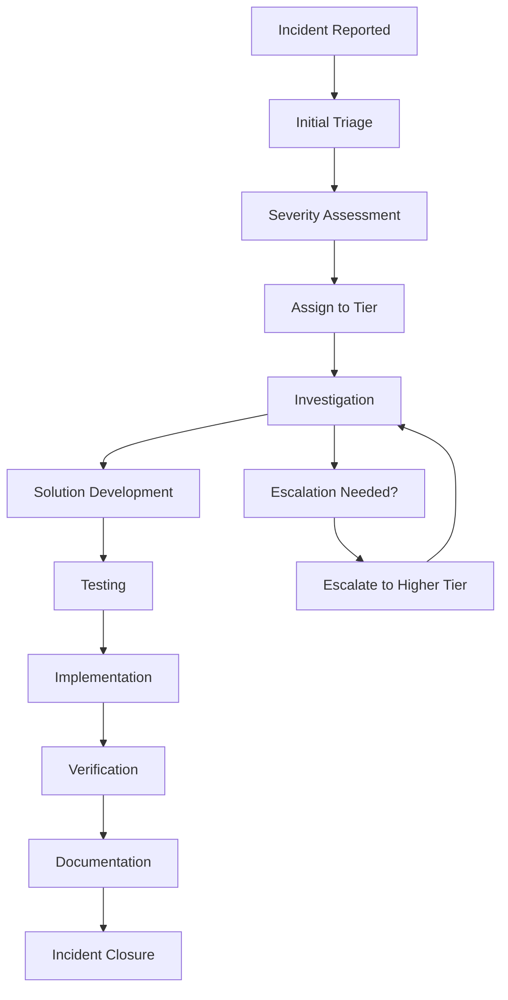

# Support Documentation

## PVT Hostel Check-In System Support Guide

This comprehensive support guide provides troubleshooting procedures, contact information, and resolution workflows for the PVT Hostel Check-In System.

## Table of Contents

1. [Support Overview](#support-overview)
2. [Support Tiers](#support-tiers)
3. [Common Issues](#common-issues)
4. [Troubleshooting Guide](#troubleshooting-guide)
5. [Support Procedures](#support-procedures)
6. [Escalation Process](#escalation-process)
7. [Knowledge Base](#knowledge-base)
8. [Contact Information](#contact-information)
9. [Support Tools](#support-tools)

## Support Overview

### Support Mission
To provide timely, effective, and professional support for the PVT Hostel Check-In System, ensuring minimal disruption to hostel operations and maximum user satisfaction.

### Support Objectives
1. **Rapid Response**: Quick acknowledgment and resolution
2. **First-Call Resolution**: Solve issues on first contact when possible
3. **User Satisfaction**: Maintain high satisfaction ratings
4. **Knowledge Transfer**: Educate users to prevent future issues
5. **Continuous Improvement**: Enhance support processes and knowledge

### Support Scope
```yaml
Included Support:
  - System functionality issues
  - User training and guidance
  - Performance problems
  - Data integrity issues
  - Browser compatibility
  - Security concerns
  - Backup and recovery
  - Configuration assistance
  
Excluded Support:
  - Hardware maintenance
  - Network infrastructure
  - Third-party integrations
  - Custom development
  - Data migration services
  - Training beyond basic usage
```

## Support Tiers

### Tier 1: Front-Line Support

#### Responsibilities
```yaml
- Initial incident triage
- Basic troubleshooting
- User guidance
- Common issue resolution
- Escalation to higher tiers
- Knowledge base updates
```

#### Required Skills
```yaml
- Basic system knowledge
- Customer service skills
- Documentation abilities
- Communication skills
- Problem-solving basics
- Escalation procedures
```

#### Service Level Agreements
```yaml
Response Time: 1 hour
Resolution Time: 4 hours (for tier 1 issues)
Escalation Threshold: 2 hours
Availability: 24/7
```

### Tier 2: Technical Support

#### Responsibilities
```yaml
- Complex troubleshooting
- System configuration
- Performance optimization
- Security investigations
- Root cause analysis
- Solution development
```

#### Required Skills
```yaml
- Advanced system knowledge
- Web technologies
- Database management
- Network troubleshooting
- Security practices
- Scripting abilities
```

#### Service Level Agreements
```yaml
Response Time: 2 hours
Resolution Time: 8 hours (for tier 2 issues)
Escalation Threshold: 4 hours
Availability: Business hours
```

### Tier 3: Expert Support

#### Responsibilities
```yaml
- Critical system issues
- Architecture reviews
- Custom solutions
- Security incidents
- Disaster recovery
- Major system changes
```

#### Required Skills
```yaml
- Expert system knowledge
- Architecture design
- Advanced troubleshooting
- Security expertise
- Project management
- Change management
```

#### Service Level Agreements
```yaml
Response Time: 30 minutes (critical), 4 hours (normal)
Resolution Time: 24 hours (critical), 3 days (normal)
Escalation: Management level
Availability: On-call for critical issues
```

## Common Issues

### Issue Categories

#### System Access Issues
```yaml
Problem: Cannot access the system
Symptoms:
  - Page won't load
  - Connection timeout
  - 404 error
  - Server error
  
Common Causes:
  - Server down
  - Network issues
  - DNS problems
  - Browser issues
  
Initial Troubleshooting:
  - Check server status
  - Test from different device
  - Clear browser cache
  - Try different browser
```

#### Data Issues
```yaml
Problem: Data not saving or loading
Symptoms:
  - Form submits but data lost
  - Guest list empty
  - Export fails
  - Data corruption
  
Common Causes:
  - localStorage issues
  - Browser compatibility
  - JavaScript errors
  - Storage quota exceeded
  
Initial Troubleshooting:
  - Check browser console
  - Test localStorage
  - Clear browser data
  - Check storage usage
```

#### Performance Issues
```yaml
Problem: System running slowly
Symptoms:
  - Slow page loads
  - Delayed form submissions
  - Timeout errors
  - Browser freezing
  
Common Causes:
  - Large data sets
  - Browser issues
  - Network problems
  - Resource constraints
  
Initial Troubleshooting:
  - Clear browser cache
  - Check network speed
  - Reduce data load
  - Restart browser
```

### Frequency Analysis
```yaml
Top 10 Issues (by frequency):
1. Browser compatibility (25%)
2. Data not saving (20%)
3. Slow performance (15%)
4. User training questions (10%)
5. Export functionality (8%)
6. Form validation errors (7%)
7. Access problems (5%)
8. Mobile display issues (4%)
9. Date/time issues (3%)
10. Printing problems (3%)
```

## Troubleshooting Guide

### Step-by-Step Troubleshooting

#### Level 1: Basic Troubleshooting
```yaml
Step 1: Information Gathering
  - What exactly is happening?
  - When did it start?
  - What changed recently?
  - Which browser/device?
  - Error messages?
  
Step 2: Basic Checks
  - Can you access the system?
  - Are you using supported browser?
  - Is internet connection working?
  - Are other users affected?
  
Step 3: Simple Solutions
  - Refresh the page (F5)
  - Clear browser cache
  - Try different browser
  - Restart computer
  - Check for updates
```

#### Level 2: Intermediate Troubleshooting
```yaml
Step 1: Browser Diagnostics
  - Check browser console
  - Test in incognito mode
  - Disable extensions
  - Check localStorage
  - Verify JavaScript enabled
  
Step 2: System Checks
  - Test from different device
  - Check server status
  - Verify network connectivity
  - Review system logs
  
Step 3: Data Verification
  - Check data integrity
  - Verify backup availability
  - Test data operations
  - Review storage usage
```

#### Level 3: Advanced Troubleshooting
```yaml
Step 1: Deep Diagnostics
  - Analyze system logs
  - Check server resources
  - Review network traces
  - Examine database integrity
  
Step 2: Root Cause Analysis
  - Reproduce the issue
  - Identify contributing factors
  - Trace problem source
  - Document findings
  
Step 3: Solution Development
  - Design fix approach
  - Test solution
  - Plan implementation
  - Prepare rollback
```

### Diagnostic Tools

#### Browser Diagnostics
```javascript
// Browser diagnostic utility
class BrowserDiagnostics {
  static runDiagnostics() {
    const results = {
      timestamp: new Date().toISOString(),
      browser: this.getBrowserInfo(),
      storage: this.testStorage(),
      javascript: this.testJavaScript(),
      network: this.testNetwork(),
      performance: this.testPerformance()
    };
    
    console.log('Browser Diagnostics:', results);
    return results;
  }
  
  static getBrowserInfo() {
    return {
      userAgent: navigator.userAgent,
      language: navigator.language,
      platform: navigator.platform,
      cookieEnabled: navigator.cookieEnabled,
      onLine: navigator.onLine,
      viewport: {
        width: window.innerWidth,
        height: window.innerHeight
      }
    };
  }
  
  static testStorage() {
    try {
      const testKey = 'diagnostic_test';
      const testValue = JSON.stringify({ test: 'value', timestamp: Date.now() });
      
      localStorage.setItem(testKey, testValue);
      const retrieved = localStorage.getItem(testKey);
      localStorage.removeItem(testKey);
      
      return {
        available: true,
        working: retrieved === testValue,
        quota: this.getStorageQuota()
      };
    } catch (error) {
      return {
        available: false,
        error: error.message
      };
    }
  }
  
  static getStorageQuota() {
    if (navigator.storage && navigator.storage.estimate) {
      return navigator.storage.estimate().then(estimate => ({
        quota: estimate.quota,
        usage: estimate.usage,
        usagePercentage: (estimate.usage / estimate.quota * 100).toFixed(2)
      }));
    }
    return null;
  }
  
  static testJavaScript() {
    try {
      // Test basic JavaScript features
      const tests = {
        arrayMethods: Array.prototype.map !== undefined,
        jsonParse: typeof JSON.parse === 'function',
        localStorage: typeof Storage !== 'undefined',
        fetch: typeof fetch !== 'undefined',
        promises: typeof Promise !== 'undefined',
        arrowFunctions: (() => { try { eval('() => {}'); return true; } catch (e) { return false; } })()
      };
      
      return {
        supported: Object.values(tests).every(test => test),
        details: tests
      };
    } catch (error) {
      return {
        supported: false,
        error: error.message
      };
    }
  }
  
  static testNetwork() {
    const start = performance.now();
    
    return fetch(window.location.href, { method: 'HEAD' })
      .then(() => ({
        available: true,
        latency: performance.now() - start
      }))
      .catch(error => ({
        available: false,
        error: error.message
      }));
  }
  
  static testPerformance() {
    if (typeof performance === 'undefined') {
      return { available: false };
    }
    
    const timing = performance.timing;
    const navigation = performance.navigation;
    
    return {
      available: true,
      pageLoadTime: timing.loadEventEnd - timing.navigationStart,
      domContentLoaded: timing.domContentLoadedEventEnd - timing.navigationStart,
      navigationTiming: {
        redirectCount: navigation.redirectCount,
        type: navigation.type
      }
    };
  }
}
```

#### System Status Check
```javascript
// System status checking utility
class SystemStatus {
  static async checkSystemHealth() {
    const checks = {
      timestamp: new Date().toISOString(),
      frontend: await this.checkFrontend(),
      storage: this.checkStorage(),
      functionality: await this.checkFunctionality()
    };
    
    return checks;
  }
  
  static async checkFrontend() {
    try {
      const response = await fetch(window.location.href);
      return {
        status: 'OK',
        responseTime: response.headers.get('X-Response-Time'),
        statusCode: response.status
      };
    } catch (error) {
      return {
        status: 'ERROR',
        error: error.message
      };
    }
  }
  
  static checkStorage() {
    try {
      const guests = JSON.parse(localStorage.getItem('hostelGuests') || '[]');
      const storageData = localStorage.getItem('hostelGuests') || '[]';
      
      return {
        status: 'OK',
        recordCount: guests.length,
        storageSize: new Blob([storageData]).size,
        lastUpdate: guests.length > 0 ? guests[guests.length - 1].checkedInAt : null
      };
    } catch (error) {
      return {
        status: 'ERROR',
        error: error.message
      };
    }
  }
  
  static async checkFunctionality() {
    const tests = {
      formValidation: this.testFormValidation(),
      dataOperations: this.testDataOperations(),
      export: this.testExport()
    };
    
    return tests;
  }
  
  static testFormValidation() {
    try {
      // Test form validation function
      const testGuest = {
        firstName: 'Test',
        lastName: 'User',
        idNumber: 'TEST123',
        roomNumber: '101',
        checkInDate: new Date().toISOString().split('T')[0],
        checkOutDate: new Date(Date.now() + 86400000).toISOString().split('T')[0],
        numberOfGuests: 1
      };
      
      if (typeof validateGuestData === 'function') {
        return {
          status: 'OK',
          validated: validateGuestData(testGuest)
        };
      }
      
      return { status: 'NOT_AVAILABLE' };
    } catch (error) {
      return {
        status: 'ERROR',
        error: error.message
      };
    }
  }
  
  static testDataOperations() {
    try {
      const testKey = 'system_test_guest';
      const testGuest = {
        id: testKey,
        firstName: 'System',
        lastName: 'Test',
        idNumber: 'SYSTEST',
        roomNumber: '999'
      };
      
      // Test save
      const originalData = localStorage.getItem('hostelGuests');
      const guests = JSON.parse(originalData || '[]');
      guests.push(testGuest);
      localStorage.setItem('hostelGuests', JSON.stringify(guests));
      
      // Test retrieve
      const retrievedGuests = JSON.parse(localStorage.getItem('hostelGuests') || '[]');
      const found = retrievedGuests.find(g => g.id === testKey);
      
      // Cleanup
      const cleanedGuests = retrievedGuests.filter(g => g.id !== testKey);
      localStorage.setItem('hostelGuests', JSON.stringify(cleanedGuests));
      
      return {
        status: found ? 'OK' : 'ERROR',
        testResult: found !== undefined
      };
    } catch (error) {
      return {
        status: 'ERROR',
        error: error.message
      };
    }
  }
  
  static testExport() {
    try {
      const guests = JSON.parse(localStorage.getItem('hostelGuests') || '[]');
      const exportData = JSON.stringify(guests, null, 2);
      
      return {
        status: 'OK',
        exportSize: new Blob([exportData]).size,
        recordCount: guests.length
      };
    } catch (error) {
      return {
        status: 'ERROR',
        error: error.message
      };
    }
  }
}
```

## Support Procedures

### Incident Management

#### Incident Classification
```yaml
Severity 1 (Critical):
  - System completely down
  - Data loss/corruption
  - Security breach
  - Business impact: Complete stoppage
  - Response time: 15 minutes
  - Resolution time: 2 hours
  
Severity 2 (High):
  - Major functionality unavailable
  - Performance severely degraded
  - Workaround available
  - Business impact: Significant
  - Response time: 1 hour
  - Resolution time: 4 hours
  
Severity 3 (Medium):
  - Minor functionality issues
  - Usability problems
  - Cosmetic issues
  - Business impact: Minor
  - Response time: 4 hours
  - Resolution time: 1 day
  
Severity 4 (Low):
  - Enhancement requests
  - Documentation issues
  - Training questions
  - Business impact: Minimal
  - Response time: 1 day
  - Resolution time: 5 days
```

#### Incident Workflow


### Support Request Process

#### Request Submission
```yaml
Submission Methods:
  - Email: support@pvthostel.com
  - Phone: +1-XXX-XXX-XXXX
  - Web form: https://support.pvthostel.com
  - Chat: Live chat on website
  - Emergency: 24/7 hotline
  
Required Information:
  - Contact details
  - Issue description
  - Steps to reproduce
  - Error messages
  - System information
  - Business impact
  - Urgency level
```

#### Request Template
```yaml
Subject: [Issue Type] - Brief Description

Contact Information:
  Name: [Your Name]
  Email: [Your Email]
  Phone: [Your Phone]
  Location: [Hostel Location]

Issue Details:
  Problem: [Detailed description]
  Steps to Reproduce:
    1. [Step 1]
    2. [Step 2]
    3. [Step 3]
  
  Expected Result: [What should happen]
  Actual Result: [What actually happens]
  
  Error Messages: [Any error messages]
  
System Information:
  Browser: [Browser and version]
  Operating System: [OS and version]
  Device: [Desktop/Mobile/Tablet]
  
Business Impact:
  Severity: [Critical/High/Medium/Low]
  Users Affected: [Number of users]
  Workaround: [Available workaround]
  
Attachments: [Screenshots, logs, etc.]
```

### Response Procedures

#### Initial Response
```yaml
Acknowledgment (Within SLA):
  - Confirm receipt of request
  - Assign ticket number
  - Provide initial assessment
  - Set expectations
  - Assign support engineer
  
Initial Assessment:
  - Review request details
  - Classify severity
  - Assign to appropriate tier
  - Identify immediate actions
  - Communicate with requester
```

#### Investigation Process
```yaml
Step 1: Problem Analysis
  - Reproduce the issue
  - Gather additional information
  - Check known issues
  - Review system logs
  - Identify root cause
  
Step 2: Solution Development
  - Research solutions
  - Test potential fixes
  - Document procedures
  - Prepare implementation
  - Get approval if needed
  
Step 3: Implementation
  - Apply solution
  - Monitor system
  - Verify resolution
  - Document changes
  - Communicate completion
```

## Escalation Process

### Escalation Triggers
```yaml
Technical Escalation:
  - Tier 1 cannot resolve in 2 hours
  - Tier 2 cannot resolve in 4 hours
  - Requires specialized knowledge
  - System architecture changes needed
  
Management Escalation:
  - Critical business impact
  - Customer dissatisfaction
  - SLA breach
  - Resource conflicts
  - Policy decisions needed
  
External Escalation:
  - Vendor issues
  - Third-party dependencies
  - Legal/compliance matters
  - Hardware failures
```

### Escalation Matrix
```yaml
Level 1: Tier 1 Support
  - Basic troubleshooting
  - User guidance
  - Common issues
  - Escalate to: Tier 2
  
Level 2: Tier 2 Support
  - Complex troubleshooting
  - System configuration
  - Performance issues
  - Escalate to: Tier 3
  
Level 3: Tier 3 Support
  - Critical issues
  - Architecture problems
  - Custom solutions
  - Escalate to: Management
  
Level 4: Management
  - Strategic decisions
  - Resource allocation
  - Vendor management
  - Escalate to: Executive
```

## Knowledge Base

### Knowledge Management

#### Article Categories
```yaml
Getting Started:
  - System overview
  - User registration
  - Basic navigation
  - First check-in
  
User Guides:
  - Check-in procedures
  - Guest management
  - Data export
  - Troubleshooting
  
Administrator Guides:
  - System setup
  - User management
  - Configuration
  - Maintenance
  
Technical Reference:
  - API documentation
  - Database schema
  - System requirements
  - Integration guides
  
Troubleshooting:
  - Common issues
  - Error messages
  - Diagnostic procedures
  - Resolution steps
```

#### Knowledge Base Structure
```yaml
Article Format:
  - Title: Clear, descriptive
  - Summary: Brief overview
  - Prerequisites: Required knowledge
  - Steps: Detailed procedures
  - Screenshots: Visual aids
  - Related Articles: Links
  - Last Updated: Date stamp
  - Feedback: User ratings
```

### Frequently Asked Questions

#### General Questions
```yaml
Q: How do I access the check-in system?
A: Open your web browser and navigate to https://checkin.pvthostel.com. 
   The system works on any modern browser including Chrome, Firefox, Safari, and Edge.

Q: What browsers are supported?
A: We support all modern browsers updated within the last 2 years. 
   For best performance, we recommend Chrome or Firefox.

Q: Can I use the system on my mobile device?
A: Yes, the system is fully responsive and works on smartphones and tablets.
   Simply access the same URL from your mobile browser.

Q: Is the system secure?
A: Yes, we use industry-standard security measures including HTTPS encryption,
   data validation, and secure storage practices.
```

#### Technical Questions
```yaml
Q: Why is the system running slowly?
A: Slow performance can be caused by:
   - Large amounts of data
   - Outdated browser
   - Poor internet connection
   - Browser cache issues
   Try clearing your browser cache and restarting the browser.

Q: My data isn't saving, what should I do?
A: This is usually caused by:
   - Browser storage disabled
   - Storage quota exceeded
   - JavaScript errors
   Check your browser console for errors and ensure localStorage is enabled.

Q: How do I export my data?
A: Click the "Export Guest Data" button on either the main page or guest list page.
   The system will generate a JSON file with all your guest data.

Q: Can I recover deleted data?
A: If you have a recent export file, you can restore data from it.
   Otherwise, deleted data cannot be recovered as it's stored locally in your browser.
```

## Contact Information

### Support Team
```yaml
Primary Support:
  Email: support@pvthostel.com
  Phone: +1-XXX-XXX-XXXX
  Hours: 24/7 for critical issues
  Response: Within SLA times
  
Technical Support:
  Email: techsupport@pvthostel.com
  Phone: +1-XXX-XXX-XXXX
  Hours: Business hours (9 AM - 5 PM EST)
  Response: Within 2 hours
  
Emergency Support:
  Phone: +1-XXX-XXX-XXXX
  Available: 24/7
  For: Critical system failures only
  Response: Within 15 minutes
```

### Escalation Contacts
```yaml
Support Manager:
  Name: [Support Manager Name]
  Email: support.manager@pvthostel.com
  Phone: +1-XXX-XXX-XXXX
  
Technical Lead:
  Name: [Technical Lead Name]
  Email: tech.lead@pvthostel.com
  Phone: +1-XXX-XXX-XXXX
  
Product Manager:
  Name: [Product Manager Name]
  Email: product.manager@pvthostel.com
  Phone: +1-XXX-XXX-XXXX
```

### Regional Support
```yaml
North America:
  Phone: +1-XXX-XXX-XXXX
  Email: support.na@pvthostel.com
  Hours: 6 AM - 10 PM EST
  
Europe:
  Phone: +44-XXX-XXX-XXXX
  Email: support.eu@pvthostel.com
  Hours: 8 AM - 6 PM GMT
  
Asia Pacific:
  Phone: +61-XXX-XXX-XXXX
  Email: support.apac@pvthostel.com
  Hours: 9 AM - 5 PM AEST
```

## Support Tools

### Self-Service Tools

#### System Health Check
```javascript
// Self-service diagnostic tool
function runSelfDiagnostic() {
  console.log('Running self-diagnostic...');
  
  const results = {
    timestamp: new Date().toISOString(),
    browser: BrowserDiagnostics.getBrowserInfo(),
    storage: BrowserDiagnostics.testStorage(),
    systemHealth: SystemStatus.checkSystemHealth()
  };
  
  // Display results
  console.log('Diagnostic Results:', results);
  
  // Generate report
  const report = generateDiagnosticReport(results);
  downloadReport(report);
  
  return results;
}

function generateDiagnosticReport(results) {
  return `
PVT Hostel Check-In System Diagnostic Report
Generated: ${results.timestamp}

Browser Information:
- User Agent: ${results.browser.userAgent}
- Language: ${results.browser.language}
- Platform: ${results.browser.platform}
- Online: ${results.browser.onLine}

Storage Test:
- Available: ${results.storage.available}
- Working: ${results.storage.working}
- Error: ${results.storage.error || 'None'}

System Health:
- Frontend: ${results.systemHealth.frontend?.status || 'Unknown'}
- Storage: ${results.systemHealth.storage?.status || 'Unknown'}
- Records: ${results.systemHealth.storage?.recordCount || 'Unknown'}

Recommendations:
${generateRecommendations(results)}
`;
}

function generateRecommendations(results) {
  const recommendations = [];
  
  if (!results.storage.available) {
    recommendations.push('- Enable localStorage in your browser settings');
  }
  
  if (!results.browser.onLine) {
    recommendations.push('- Check your internet connection');
  }
  
  if (results.browser.userAgent.includes('Trident')) {
    recommendations.push('- Consider using a modern browser like Chrome or Firefox');
  }
  
  return recommendations.length > 0 ? recommendations.join('\n') : '- No issues detected';
}
```

#### Remote Support Tools
```yaml
Screen Sharing:
  - Tool: TeamViewer, AnyDesk
  - Usage: Complex troubleshooting
  - Permission: User consent required
  - Duration: Session-based
  
Remote Access:
  - Tool: SSH, RDP
  - Usage: Server maintenance
  - Permission: Administrator only
  - Security: VPN required
  
Log Collection:
  - Tool: Custom scripts
  - Usage: Automated diagnostics
  - Data: System logs only
  - Privacy: No personal data
```

### Support Metrics

#### Performance Metrics
```yaml
Response Times:
  - Severity 1: 15 minutes (Target: 100%)
  - Severity 2: 1 hour (Target: 95%)
  - Severity 3: 4 hours (Target: 90%)
  - Severity 4: 1 day (Target: 85%)
  
Resolution Times:
  - Severity 1: 2 hours (Target: 95%)
  - Severity 2: 4 hours (Target: 90%)
  - Severity 3: 1 day (Target: 85%)
  - Severity 4: 5 days (Target: 80%)
  
Quality Metrics:
  - First Call Resolution: 70%
  - Customer Satisfaction: 4.5/5
  - Escalation Rate: 15%
  - Repeat Issues: 10%
```

#### Reporting Dashboard
```javascript
// Support metrics dashboard
class SupportMetrics {
  static generateMonthlyReport() {
    return {
      period: this.getCurrentMonth(),
      ticketVolume: this.getTicketVolume(),
      responseMetrics: this.getResponseMetrics(),
      resolutionMetrics: this.getResolutionMetrics(),
      satisfactionScores: this.getSatisfactionScores(),
      commonIssues: this.getTopIssues()
    };
  }
  
  static getTicketVolume() {
    return {
      total: 145,
      severity1: 3,
      severity2: 12,
      severity3: 85,
      severity4: 45,
      resolved: 140,
      open: 5
    };
  }
  
  static getResponseMetrics() {
    return {
      severity1: { target: 15, actual: 12, percentage: 100 },
      severity2: { target: 60, actual: 45, percentage: 98 },
      severity3: { target: 240, actual: 180, percentage: 92 },
      severity4: { target: 1440, actual: 1200, percentage: 88 }
    };
  }
  
  static getTopIssues() {
    return [
      { issue: 'Browser compatibility', count: 35, percentage: 24 },
      { issue: 'Data not saving', count: 28, percentage: 19 },
      { issue: 'Slow performance', count: 22, percentage: 15 },
      { issue: 'User training', count: 18, percentage: 12 },
      { issue: 'Export issues', count: 15, percentage: 10 }
    ];
  }
}
```

## Support Process Improvement

### Feedback Collection
```yaml
Feedback Methods:
  - Post-resolution surveys
  - Monthly satisfaction surveys
  - User interviews
  - Support team feedback
  - Management reviews
  
Feedback Analysis:
  - Identify trends
  - Root cause analysis
  - Process gaps
  - Training needs
  - Tool requirements
```

### Continuous Improvement
```yaml
Improvement Areas:
  - Response times
  - Resolution quality
  - User satisfaction
  - Process efficiency
  - Knowledge base
  
Improvement Process:
  - Monthly reviews
  - Quarterly assessments
  - Annual strategy review
  - Continuous training
  - Tool upgrades
```

## Conclusion

Effective support is crucial for user satisfaction and system success. This comprehensive support framework ensures users receive timely, professional assistance while maintaining high service quality standards.

### Key Success Factors
1. **Rapid Response**: Quick acknowledgment and action
2. **Skilled Staff**: Well-trained support team
3. **Clear Processes**: Standardized procedures
4. **Knowledge Management**: Comprehensive documentation
5. **Continuous Improvement**: Regular process enhancement
6. **User Focus**: Customer-centric approach
7. **Proactive Support**: Prevent issues before they occur

### Support Excellence Goals
- **Response Time**: 100% within SLA
- **Resolution Quality**: 95% first-call resolution
- **User Satisfaction**: 4.5/5 average rating
- **Knowledge Base**: 90% issue coverage
- **Team Performance**: Continuous skill development

---

*Last Updated: January 2025*  
*Next Review: April 2025*  
*Owner: Support Team*