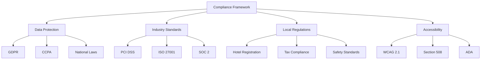
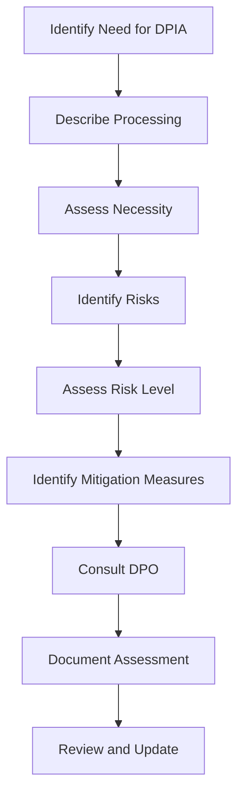

# Compliance Documentation

## PVT Hostel Check-In System Compliance Framework

This document outlines the compliance requirements, implementation strategies, and ongoing obligations for the PVT Hostel Check-In System to meet regulatory and industry standards.

## Table of Contents

1. [Compliance Overview](#compliance-overview)
2. [GDPR Compliance](#gdpr-compliance)
3. [Data Protection Laws](#data-protection-laws)
4. [Hospitality Industry Standards](#hospitality-industry-standards)
5. [PCI DSS Compliance](#pci-dss-compliance)
6. [Accessibility Standards](#accessibility-standards)
7. [Local Regulations](#local-regulations)
8. [Audit and Monitoring](#audit-and-monitoring)

## Compliance Overview

### Regulatory Landscape

The PVT Hostel Check-In System must comply with multiple regulatory frameworks:



### Compliance Principles

1. **Privacy by Design**: Build privacy into system architecture
2. **Data Minimization**: Collect only necessary information
3. **Transparency**: Clear privacy policies and notices
4. **Accountability**: Demonstrate compliance through documentation
5. **Continuous Monitoring**: Regular compliance assessments

## GDPR Compliance

### Article 5: Principles of Processing

#### 1. Lawfulness, Fairness, and Transparency
```yaml
Implementation:
  - Clear privacy notice on data collection
  - Explicit consent for optional data
  - Easy-to-understand language
  - Regular policy updates
  
Evidence:
  - Privacy policy document
  - Consent management system
  - User interface screenshots
  - Legal basis documentation
```

#### 2. Purpose Limitation
```yaml
Implementation:
  - Define specific purposes for data collection
  - Restrict use to stated purposes
  - Document purpose changes
  - Implement technical controls
  
Data Purposes:
  - Guest registration
  - Room assignment
  - Legal compliance
  - Emergency contact
```

#### 3. Data Minimization
```yaml
Current Data Collection:
  Required:
    - First name
    - Last name
    - ID/Passport number
    - Room number
    - Check-in date
    - Check-out date
    - Number of guests
  
  Optional:
    - Email address
    - Phone number
    - Additional notes
```

#### 4. Accuracy
```yaml
Implementation:
  - Data validation at input
  - Regular accuracy checks
  - Guest verification process
  - Correction mechanisms
  
Technical Controls:
  - Input validation functions
  - Data format standardization
  - Duplicate detection
  - Update tracking
```

#### 5. Storage Limitation
```yaml
Retention Schedule:
  Guest Records: 3 years after checkout
  Financial Records: 7 years (tax requirements)
  System Logs: 1 year
  Backup Data: 30 days
  
Deletion Process:
  - Automated deletion triggers
  - Secure data destruction
  - Certificate of destruction
  - Audit trail maintenance
```

#### 6. Integrity and Confidentiality
```yaml
Security Measures:
  - Encryption at rest
  - HTTPS for transmission
  - Access controls
  - Audit logging
  - Regular security assessments
```

### Data Subject Rights

#### Right to Information (Art. 13-14)
```yaml
Privacy Notice Requirements:
  - Identity of data controller
  - Purpose of processing
  - Legal basis
  - Data retention periods
  - Data subject rights
  - Contact information
  - Right to withdraw consent
```

**Implementation:**
```html
<!-- Privacy notice on check-in form -->
<div class="privacy-notice">
  <h3>Privacy Notice</h3>
  <p>PVT Hostel collects this information for guest registration and legal compliance. 
     Your data will be retained for 3 years and processed lawfully under Article 6(1)(b) GDPR.</p>
  <p>You have the right to access, rectify, or delete your personal data. 
     Contact privacy@pvthostel.com for any requests.</p>
</div>
```

#### Right of Access (Art. 15)
```yaml
Response Requirements:
  - Within 30 days
  - Free of charge
  - Confirm processing
  - Provide copy of data
  - Explain purposes
  - Identify recipients
  - Retention period
```

**Implementation Process:**
```javascript
function handleDataSubjectRequest(request) {
  const requestLog = {
    timestamp: new Date().toISOString(),
    type: request.type,
    requesterId: request.requesterId,
    status: 'received'
  };
  
  // Log the request
  logDataSubjectRequest(requestLog);
  
  // Verify identity
  if (!verifyIdentity(request)) {
    return { status: 'identity_verification_required' };
  }
  
  // Process request based on type
  switch (request.type) {
    case 'access':
      return processAccessRequest(request);
    case 'rectification':
      return processRectificationRequest(request);
    case 'erasure':
      return processErasureRequest(request);
    default:
      return { status: 'unsupported_request' };
  }
}
```

#### Right to Rectification (Art. 16)
```yaml
Process:
  - Verify identity
  - Assess accuracy
  - Make corrections
  - Notify third parties
  - Document changes
```

#### Right to Erasure (Art. 17)
```yaml
Grounds for Erasure:
  - No longer necessary
  - Consent withdrawn
  - Unlawful processing
  - Legal obligation
  - Child's data
  
Exceptions:
  - Legal obligations
  - Public interest
  - Legal claims
```

#### Right to Data Portability (Art. 20)
```yaml
Requirements:
  - Structured format
  - Commonly used
  - Machine readable
  - Transmit to another controller
  
Export Format:
  - JSON preferred
  - CSV acceptable
  - XML if requested
```

### Data Protection Officer (DPO)

#### When Required
```yaml
Appointment Required If:
  - Public authority
  - Core activities involve regular monitoring
  - Large scale processing of special categories
  - High risk processing
```

#### Responsibilities
```yaml
DPO Duties:
  - Monitor compliance
  - Conduct privacy impact assessments
  - Serve as contact point
  - Provide training
  - Advise on data protection
```

### Data Protection Impact Assessment (DPIA)

#### When Required
```yaml
DPIA Triggers:
  - High risk processing
  - Systematic monitoring
  - Large scale processing
  - Special categories of data
  - Automated decision-making
```

#### DPIA Process


### Breach Notification

#### Breach Assessment
```yaml
Risk Assessment Criteria:
  - Type of data involved
  - Number of individuals affected
  - Likelihood of harm
  - Severity of consequences
  - Mitigation measures
```

#### Notification Requirements
```yaml
Supervisory Authority:
  - Within 72 hours
  - Include risk assessment
  - Describe mitigation measures
  - Provide contact information
  
Data Subjects:
  - When high risk
  - Clear and plain language
  - Describe likely consequences
  - Explain mitigation measures
```

## Data Protection Laws

### California Consumer Privacy Act (CCPA)

#### Consumer Rights
```yaml
Rights Under CCPA:
  - Right to know
  - Right to delete
  - Right to opt-out
  - Right to non-discrimination
  - Right to correct
```

#### Implementation
```javascript
// CCPA compliance functions
function handleCCPARequest(request) {
  const validRequestTypes = ['know', 'delete', 'opt-out', 'correct'];
  
  if (!validRequestTypes.includes(request.type)) {
    return { error: 'Invalid request type' };
  }
  
  // Verify California residency
  if (!isCaliforniaResident(request.requesterId)) {
    return { error: 'CCPA only applies to California residents' };
  }
  
  return processRequest(request);
}
```

### Other International Laws

#### Brazil (LGPD)
```yaml
Key Requirements:
  - Lawful basis for processing
  - Data subject rights
  - Data protection officer
  - Impact assessments
  - Breach notification
```

#### Canada (PIPEDA)
```yaml
Key Requirements:
  - Consent requirements
  - Purpose limitation
  - Accuracy obligations
  - Safeguards
  - Individual access
```

## Hospitality Industry Standards

### Guest Registration Requirements

#### Legal Obligations
```yaml
Common Requirements:
  - Guest identification
  - Registration records
  - Minimum retention periods
  - Authority access
  - Reporting obligations
```

#### Implementation
```javascript
function validateGuestRegistration(guest) {
  const validationRules = {
    idNumber: {
      required: true,
      minLength: 6,
      maxLength: 20,
      pattern: /^[A-Z0-9]+$/
    },
    nationality: {
      required: true,
      validValues: getValidCountries()
    },
    checkInDate: {
      required: true,
      minDate: new Date()
    }
  };
  
  return validateAgainstRules(guest, validationRules);
}
```

### Data Sharing with Authorities

#### Police Requests
```yaml
Process:
  - Verify authority
  - Check legal basis
  - Limit data scope
  - Document request
  - Provide data
  - Notify guest (if legally permissible)
```

#### Immigration Compliance
```yaml
Requirements:
  - Foreign guest registration
  - Reporting timelines
  - Data accuracy
  - Retention periods
  - Access provision
```

## PCI DSS Compliance

### Applicability
```yaml
Current System:
  - No payment processing
  - No card data storage
  - No transmission of CHD
  Status: Not applicable
  
Future Implementation:
  - If payment processing added
  - PCI DSS compliance required
  - Regular assessments needed
```

### Future Requirements
```yaml
PCI DSS Requirements:
  1. Install and maintain firewall
  2. Don't use vendor defaults
  3. Protect stored cardholder data
  4. Encrypt transmission of CHD
  5. Use and update anti-virus
  6. Develop secure systems
  7. Restrict access by business need
  8. Identify and authenticate access
  9. Restrict physical access
  10. Track and monitor access
  11. Test security systems
  12. Maintain information security policy
```

## Accessibility Standards

### WCAG 2.1 Compliance

#### Level A Requirements
```yaml
Perceivable:
  - Text alternatives for images
  - Captions for audio
  - Meaningful sequence
  - Color not sole indicator
  
Operable:
  - Keyboard accessible
  - No seizure triggers
  - Sufficient time limits
  - Navigation helps
  
Understandable:
  - Readable text
  - Predictable functionality
  - Input assistance
  
Robust:
  - Compatible with assistive technology
  - Valid markup
```

#### Implementation
```html
<!-- Accessible form example -->
<form id="guestForm" aria-label="Guest Check-In Form">
  <fieldset>
    <legend>Guest Information</legend>
    
    <div class="form-group">
      <label for="firstName" id="firstName-label">
        First Name <span aria-label="required">*</span>
      </label>
      <input type="text" 
             id="firstName" 
             name="firstName" 
             required 
             aria-describedby="firstName-error"
             aria-labelledby="firstName-label">
      <div id="firstName-error" 
           class="error-message" 
           aria-live="polite" 
           role="alert"></div>
    </div>
  </fieldset>
</form>
```

### Section 508 Compliance

#### Technical Standards
```yaml
Requirements:
  - Keyboard navigation
  - Screen reader compatibility
  - Color contrast ratios
  - Alternative text
  - Focus indicators
  - Error identification
```

## Local Regulations

### Hotel Registration Laws

#### Common Requirements
```yaml
Guest Registration:
  - Full name
  - Date of birth
  - Nationality
  - Identity document
  - Address
  - Check-in time
  - Check-out time
  - Signature
```

#### Retention Requirements
```yaml
Typical Periods:
  - Europe: 3-6 months
  - USA: Varies by state
  - Asia: 1-3 years
  - Australia: 3 years
```

### Tax Compliance

#### Tourist Tax
```yaml
Requirements:
  - Tax calculation
  - Collection records
  - Reporting to authorities
  - Guest notification
  - Exemption handling
```

#### VAT/Sales Tax
```yaml
Requirements:
  - Tax-inclusive pricing
  - Proper invoicing
  - Tax reporting
  - Record keeping
  - Audit trail
```

## Audit and Monitoring

### Internal Audit Program

#### Audit Schedule
```yaml
Monthly Audits:
  - Data access logs
  - User activity review
  - Security controls
  - Compliance checks
  
Quarterly Audits:
  - Risk assessments
  - Policy updates
  - Training effectiveness
  - Incident analysis
  
Annual Audits:
  - Comprehensive review
  - Third-party assessment
  - Compliance certification
  - Strategic planning
```

### Compliance Monitoring

#### Key Metrics
```yaml
Privacy Metrics:
  - Data subject requests
  - Response times
  - Breach incidents
  - Training completion
  - Policy updates
  
Security Metrics:
  - Access violations
  - Failed login attempts
  - System vulnerabilities
  - Patch levels
  - Backup success rates
```

### Documentation Requirements

#### Compliance Records
```yaml
Required Documentation:
  - Privacy policies
  - Data processing records
  - Consent management
  - Breach notifications
  - Audit reports
  - Training records
  - Risk assessments
  - Third-party agreements
```

#### Record Retention
```yaml
Retention Schedule:
  - Privacy policies: 7 years
  - Audit reports: 7 years
  - Breach records: 5 years
  - Training records: 3 years
  - Risk assessments: 3 years
```

## Compliance Checklist

### Implementation Checklist
```yaml
Privacy Framework:
  ☐ Privacy policy published
  ☐ Consent mechanisms implemented
  ☐ Data subject rights procedures
  ☐ Breach response plan
  ☐ Staff training completed
  ☐ DPO appointed (if required)
  ☐ Records of processing maintained
  ☐ Third-party agreements updated
  
Security Controls:
  ☐ Access controls implemented
  ☐ Encryption deployed
  ☐ Backup procedures tested
  ☐ Audit logging enabled
  ☐ Security monitoring active
  ☐ Incident response plan
  ☐ Regular assessments scheduled
  
Operational Compliance:
  ☐ Staff training program
  ☐ Regular compliance reviews
  ☐ Documentation management
  ☐ Vendor assessments
  ☐ Policy updates scheduled
  ☐ Audit program established
```

### Ongoing Obligations

#### Regular Tasks
```yaml
Daily:
  - Monitor security logs
  - Review access reports
  - Check system health
  
Weekly:
  - Compliance dashboard review
  - Security updates
  - Staff reminders
  
Monthly:
  - Compliance metrics review
  - Policy updates
  - Training assessments
  
Quarterly:
  - Risk assessments
  - Vendor reviews
  - Compliance audits
  
Annually:
  - Comprehensive review
  - Policy overhaul
  - Training refresh
  - External assessment
```

## Contact Information

### Compliance Team
```yaml
Data Protection Officer:
  - Email: dpo@pvthostel.com
  - Phone: +1-XXX-XXX-XXXX
  
Privacy Officer:
  - Email: privacy@pvthostel.com
  - Phone: +1-XXX-XXX-XXXX
  
Legal Counsel:
  - Email: legal@pvthostel.com
  - Phone: +1-XXX-XXX-XXXX
  
Compliance Manager:
  - Email: compliance@pvthostel.com
  - Phone: +1-XXX-XXX-XXXX
```

### Regulatory Contacts
```yaml
Supervisory Authority:
  - Name: [Local Data Protection Authority]
  - Website: [Authority Website]
  - Email: [Authority Email]
  - Phone: [Authority Phone]
  
Industry Associations:
  - Hospitality Industry Association
  - Data Protection Organizations
  - Professional Compliance Bodies
```

## Conclusion

Compliance is an ongoing responsibility that requires continuous attention and regular updates. This framework provides the foundation for maintaining regulatory compliance while operating the PVT Hostel Check-In System.

### Key Success Factors
1. **Proactive Approach**: Stay ahead of regulatory changes
2. **Staff Training**: Ensure all staff understand obligations
3. **Regular Reviews**: Monitor and update procedures
4. **Documentation**: Maintain comprehensive records
5. **Professional Support**: Engage legal and compliance experts

For specific compliance questions or updates, consult with qualified legal and compliance professionals familiar with your jurisdiction and industry.

---

*Last Updated: January 2025*  
*Next Review: April 2025*  
*Classification: Internal Use*  
*Owner: Compliance Team*