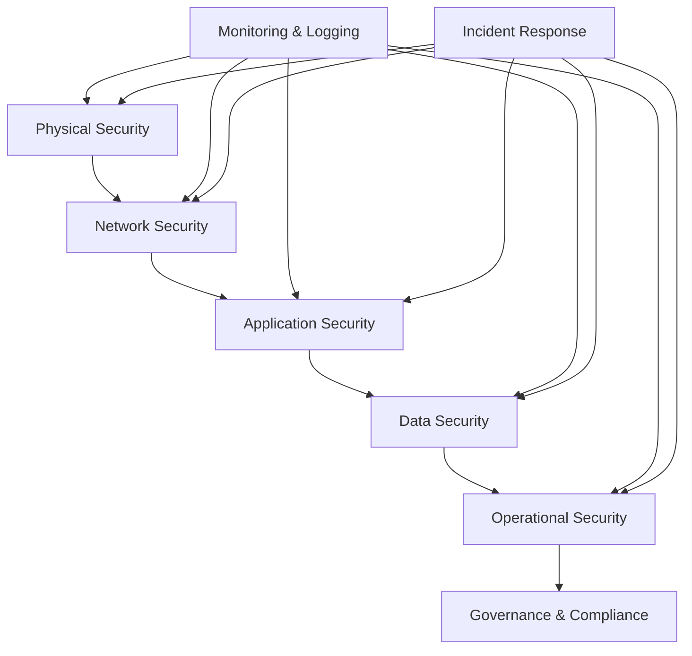
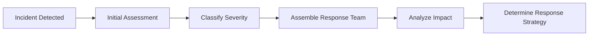

# Security Guidelines

## PVT Hostel Check-In System Security Framework

This document establishes comprehensive security guidelines for the PVT Hostel Check-In System, ensuring the protection of guest data, system integrity, and operational security.

## Table of Contents

1. [Security Overview](#security-overview)
2. [Data Protection](#data-protection)
3. [Access Control](#access-control)
4. [Infrastructure Security](#infrastructure-security)
5. [Application Security](#application-security)
6. [Operational Security](#operational-security)
7. [Incident Response](#incident-response)
8. [Compliance Requirements](#compliance-requirements)

## Security Overview

### Security Principles

#### 1. Defense in Depth
Multiple layers of security controls to protect against various threats:
- Physical security
- Network security
- Application security
- Data security
- Operational security

#### 2. Principle of Least Privilege
Users and processes should have only the minimum access required:
- Role-based access control
- Regular access reviews
- Temporary access for specific tasks
- Immediate revocation when not needed

#### 3. Zero Trust Architecture
Never trust, always verify:
- Verify every access request
- Assume breach mentality
- Continuous monitoring
- Micro-segmentation

### Security Framework



## Data Protection

### Data Classification

#### 1. Public Data
- Marketing materials
- General hostel information
- Published policies

**Protection Level:** Basic  
**Access:** No restrictions

#### 2. Internal Data
- Staff schedules
- Operational procedures
- System documentation

**Protection Level:** Standard  
**Access:** Authorized personnel only

#### 3. Confidential Data
- Guest personal information
- Financial records
- System configurations

**Protection Level:** High  
**Access:** Need-to-know basis

#### 4. Restricted Data
- Payment card information
- Legal documents
- Security credentials

**Protection Level:** Maximum  
**Access:** Strictly controlled

### Data Handling Requirements

#### Guest Personal Information
```yaml
Data Type: Guest Records
Classification: Confidential
Storage: Encrypted at rest
Transmission: HTTPS only
Retention: 3 years maximum
Disposal: Secure deletion
```

#### Required Data Elements
- **Collect only necessary data**
- **Validate data accuracy**
- **Encrypt sensitive fields**
- **Mask display (e.g., ID numbers)**
- **Audit all access**

### Data Encryption

#### At Rest
```javascript
// Example: Client-side encryption for sensitive data
function encryptSensitiveData(data) {
  const key = getEncryptionKey();
  return CryptoJS.AES.encrypt(JSON.stringify(data), key).toString();
}

function decryptSensitiveData(encryptedData) {
  const key = getEncryptionKey();
  const bytes = CryptoJS.AES.decrypt(encryptedData, key);
  return JSON.parse(bytes.toString(CryptoJS.enc.Utf8));
}
```

#### In Transit
- **TLS 1.3 minimum** for all communications
- **HTTPS enforced** for all web traffic
- **Certificate pinning** for critical connections
- **No sensitive data in URLs**

### Data Minimization

#### Collection Principles
1. **Purpose Limitation**: Collect only for specified purposes
2. **Necessity Test**: Is this data absolutely necessary?
3. **Proportionality**: Collection proportional to purpose
4. **Retention Limits**: Define clear retention periods

#### Implementation
```javascript
// Data validation and minimization
function validateGuestData(data) {
  const requiredFields = ['firstName', 'lastName', 'idNumber', 'roomNumber'];
  const optionalFields = ['email', 'phone', 'notes'];
  
  // Remove any fields not in allowed lists
  const cleanData = {};
  [...requiredFields, ...optionalFields].forEach(field => {
    if (data[field]) {
      cleanData[field] = sanitizeInput(data[field]);
    }
  });
  
  return cleanData;
}
```

## Access Control

### Authentication

#### Current System
- **Physical access control** (computer access)
- **Browser-based sessions**
- **No centralized authentication**

#### Future Enhancements
```yaml
Authentication Methods:
  - Username/Password
  - Multi-factor Authentication (MFA)
  - Single Sign-On (SSO)
  - Session management
```

### Authorization

#### Role-Based Access Control (RBAC)

```yaml
Roles:
  Ambassador:
    - Create guest records
    - View guest list
    - Check out guests
    - Export daily data
  
  Supervisor:
    - All Ambassador permissions
    - Edit guest records
    - Generate reports
    - Manage staff access
  
  Manager:
    - All Supervisor permissions
    - System configuration
    - Audit logs
    - User management
  
  Admin:
    - All permissions
    - System maintenance
    - Security settings
    - Backup management
```

### Session Management

#### Security Controls
```javascript
// Session timeout configuration
const SESSION_CONFIG = {
  timeout: 30 * 60 * 1000, // 30 minutes
  warningTime: 5 * 60 * 1000, // 5 minutes warning
  maxIdleTime: 15 * 60 * 1000, // 15 minutes idle
  refreshInterval: 5 * 60 * 1000 // 5 minutes refresh
};

// Session monitoring
function initSessionMonitoring() {
  let lastActivity = Date.now();
  
  // Track user activity
  document.addEventListener('mousedown', updateActivity);
  document.addEventListener('keypress', updateActivity);
  
  // Check session timeout
  setInterval(checkSessionTimeout, 60000);
}
```

## Infrastructure Security

### Network Security

#### Network Segmentation
```
Internet
    ↓
[Firewall/WAF]
    ↓
[DMZ - Web Server]
    ↓
[Internal Network]
    ↓
[Secure Zone - Database]
```

#### Firewall Rules
```yaml
Inbound Rules:
  - Port 80: Redirect to 443
  - Port 443: HTTPS traffic only
  - Port 22: SSH (admin IP only)
  - All other ports: DENIED

Outbound Rules:
  - Port 443: HTTPS for updates
  - Port 53: DNS queries
  - Port 80: HTTP for redirects
  - All other ports: DENIED
```

### Web Application Firewall (WAF)

#### Protection Rules
```yaml
WAF Rules:
  - SQL Injection protection
  - XSS prevention
  - CSRF protection
  - Rate limiting
  - Geo-blocking (if needed)
  - Bot protection
```

### SSL/TLS Configuration

#### Certificate Management
```bash
# Certificate requirements
Certificate Type: EV SSL preferred
Key Length: 2048 bits minimum
Signature Algorithm: SHA-256
Validity: 1 year maximum
Auto-renewal: Enabled
```

#### Security Headers
```
Strict-Transport-Security: max-age=31536000; includeSubDomains
X-Content-Type-Options: nosniff
X-Frame-Options: DENY
X-XSS-Protection: 1; mode=block
Content-Security-Policy: default-src 'self'
Referrer-Policy: strict-origin-when-cross-origin
```

## Application Security

### Input Validation

#### Client-Side Validation
```javascript
function validateInput(input, type) {
  switch (type) {
    case 'name':
      return /^[a-zA-Z\s\-']{1,50}$/.test(input);
    case 'email':
      return /^[^\s@]+@[^\s@]+\.[^\s@]+$/.test(input);
    case 'phone':
      return /^\+?[\d\s\-\(\)]{10,15}$/.test(input);
    case 'idNumber':
      return /^[A-Z0-9]{6,20}$/.test(input);
    case 'roomNumber':
      return /^[A-Z0-9]{1,10}$/.test(input);
    default:
      return false;
  }
}
```

#### Server-Side Validation (Future)
```javascript
function serverValidateGuest(data) {
  const errors = [];
  
  // Required field validation
  if (!data.firstName || data.firstName.length < 1) {
    errors.push('First name is required');
  }
  
  // Data type validation
  if (data.numberOfGuests && !Number.isInteger(data.numberOfGuests)) {
    errors.push('Number of guests must be an integer');
  }
  
  // Range validation
  if (data.numberOfGuests < 1 || data.numberOfGuests > 10) {
    errors.push('Number of guests must be between 1 and 10');
  }
  
  return errors;
}
```

### Output Encoding

#### HTML Encoding
```javascript
function escapeHtml(unsafe) {
  return unsafe
    .replace(/&/g, "&amp;")
    .replace(/</g, "&lt;")
    .replace(/>/g, "&gt;")
    .replace(/"/g, "&quot;")
    .replace(/'/g, "&#039;");
}

// Use when displaying user data
function displayGuestName(firstName, lastName) {
  return escapeHtml(firstName) + ' ' + escapeHtml(lastName);
}
```

### Cross-Site Scripting (XSS) Prevention

#### Content Security Policy
```html
<meta http-equiv="Content-Security-Policy" content="
  default-src 'self';
  script-src 'self' 'unsafe-inline';
  style-src 'self' 'unsafe-inline';
  img-src 'self' data:;
  font-src 'self';
  connect-src 'self';
  frame-ancestors 'none';
">
```

#### Input Sanitization
```javascript
function sanitizeInput(input) {
  if (typeof input !== 'string') {
    return '';
  }
  
  // Remove potentially dangerous characters
  return input
    .replace(/<script\b[^<]*(?:(?!<\/script>)<[^<]*)*<\/script>/gi, '')
    .replace(/<[^>]+>/g, '')
    .replace(/javascript:/gi, '')
    .replace(/on\w+\s*=/gi, '')
    .trim();
}
```

### Cross-Site Request Forgery (CSRF) Protection

#### Token Implementation (Future)
```javascript
// Generate CSRF token
function generateCSRFToken() {
  return btoa(Math.random().toString()).substr(10, 32);
}

// Validate CSRF token
function validateCSRFToken(token) {
  const sessionToken = sessionStorage.getItem('csrfToken');
  return token === sessionToken;
}
```

## Operational Security

### Secure Development Practices

#### Code Review Checklist
```yaml
Security Review Items:
  - Input validation implemented
  - Output encoding applied
  - Authentication checks present
  - Authorization verified
  - Error handling secure
  - Logging implemented
  - Secrets not hardcoded
  - Dependencies updated
```

#### Secure Coding Standards
```javascript
// Good: Parameterized queries (future implementation)
function getGuest(id) {
  return db.prepare('SELECT * FROM guests WHERE id = ?').get(id);
}

// Good: Input validation
function createGuest(data) {
  if (!validateGuestData(data)) {
    throw new Error('Invalid guest data');
  }
  return saveGuest(data);
}

// Good: Error handling
function handleError(error) {
  console.error('System error:', error.message);
  // Don't expose internal details to users
  return { success: false, message: 'An error occurred' };
}
```

### Security Monitoring

#### Logging Requirements
```javascript
// Security event logging
function logSecurityEvent(event, details) {
  const logEntry = {
    timestamp: new Date().toISOString(),
    event: event,
    details: details,
    userAgent: navigator.userAgent,
    ip: getClientIP(),
    sessionId: getSessionId()
  };
  
  console.log('SECURITY:', JSON.stringify(logEntry));
  
  // Send to security monitoring (future)
  // sendToSecurityLog(logEntry);
}

// Usage examples
logSecurityEvent('FAILED_LOGIN', { username: 'admin', attempts: 3 });
logSecurityEvent('DATA_EXPORT', { recordCount: 150, user: 'john.doe' });
```

### Backup Security

#### Backup Encryption
```bash
# Encrypt backup files
gpg --symmetric --cipher-algo AES256 --compress-algo 1 \
    --output backup.gpg backup.json

# Decrypt backup files
gpg --decrypt backup.gpg > backup.json
```

#### Backup Verification
```javascript
function verifyBackup(backupData) {
  try {
    const data = JSON.parse(backupData);
    
    // Verify structure
    if (!Array.isArray(data)) {
      throw new Error('Backup data is not an array');
    }
    
    // Verify record integrity
    data.forEach((record, index) => {
      if (!record.id || !record.firstName || !record.lastName) {
        throw new Error(`Invalid record at index ${index}`);
      }
    });
    
    return { valid: true, recordCount: data.length };
  } catch (error) {
    return { valid: false, error: error.message };
  }
}
```

## Incident Response

### Incident Classification

#### Severity Levels
```yaml
Critical (P1):
  - Data breach
  - System compromise
  - Complete service outage
  Response Time: Immediate (15 minutes)
  
High (P2):
  - Partial service outage
  - Security vulnerability
  - Data corruption
  Response Time: 1 hour
  
Medium (P3):
  - Performance degradation
  - Minor security issue
  - Feature malfunction
  Response Time: 4 hours
  
Low (P4):
  - Cosmetic issues
  - Enhancement requests
  - Minor bugs
  Response Time: 24 hours
```

### Incident Response Process

#### 1. Detection and Analysis


#### 2. Containment and Eradication
```yaml
Immediate Actions:
  - Isolate affected systems
  - Preserve evidence
  - Document all actions
  - Communicate with stakeholders
  
Containment Strategies:
  - Network isolation
  - Account lockdown
  - System shutdown
  - Data quarantine
```

#### 3. Recovery and Lessons Learned
```yaml
Recovery Steps:
  - Verify threat elimination
  - Restore from clean backups
  - Update security controls
  - Monitor for recurrence
  
Post-Incident:
  - Conduct root cause analysis
  - Update procedures
  - Staff training
  - Improve monitoring
```

### Security Contacts

#### Incident Response Team
```yaml
Security Manager:
  - Name: [To be assigned]
  - Email: security@pvthostel.com
  - Phone: +1-XXX-XXX-XXXX
  - Role: Incident commander

IT Manager:
  - Name: [To be assigned]
  - Email: it@pvthostel.com
  - Phone: +1-XXX-XXX-XXXX
  - Role: Technical lead

Legal Counsel:
  - Name: [To be assigned]
  - Email: legal@pvthostel.com
  - Phone: +1-XXX-XXX-XXXX
  - Role: Legal compliance
```

## Compliance Requirements

### Regulatory Compliance

#### GDPR (General Data Protection Regulation)
```yaml
Requirements:
  - Lawful basis for processing
  - Data subject rights
  - Privacy by design
  - Data breach notification
  - Data protection officer
  - Privacy impact assessments
```

#### PCI DSS (If handling payments)
```yaml
Requirements:
  - Secure network architecture
  - Protect cardholder data
  - Vulnerability management
  - Strong access controls
  - Regular monitoring
  - Information security policy
```

### Audit Requirements

#### Internal Audits
```yaml
Frequency: Monthly
Scope:
  - Access control review
  - Log analysis
  - Vulnerability assessment
  - Compliance check
  - Policy review
  
Documentation:
  - Audit findings
  - Remediation plans
  - Follow-up actions
  - Management response
```

#### External Audits
```yaml
Frequency: Annual
Scope:
  - Security posture assessment
  - Compliance validation
  - Penetration testing
  - Policy review
  - Staff interviews
  
Deliverables:
  - Audit report
  - Risk assessment
  - Recommendations
  - Remediation timeline
```

### Security Awareness Training

#### Training Program
```yaml
New Employee:
  - Security overview (2 hours)
  - Password policy
  - Incident reporting
  - Data handling procedures
  
Ongoing Training:
  - Monthly security tips
  - Quarterly phishing tests
  - Annual policy review
  - Incident response drills
```

## Conclusion

Security is a continuous process requiring vigilance, proper procedures, and regular updates. This framework provides the foundation for protecting the PVT Hostel Check-In System and guest data.

### Key Takeaways
1. **Defense in Depth**: Multiple security layers
2. **Regular Updates**: Keep systems current
3. **Staff Training**: Security awareness is crucial
4. **Incident Preparedness**: Be ready to respond
5. **Continuous Monitoring**: Watch for threats

For specific security implementations, refer to the technical documentation and consult with security professionals.

---

*Last Updated: January 2025*  
*Next Review: April 2025*  
*Classification: Internal Use*  
*Owner: Security Team*