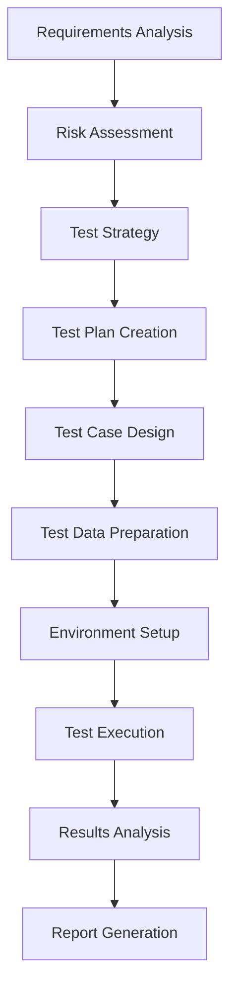
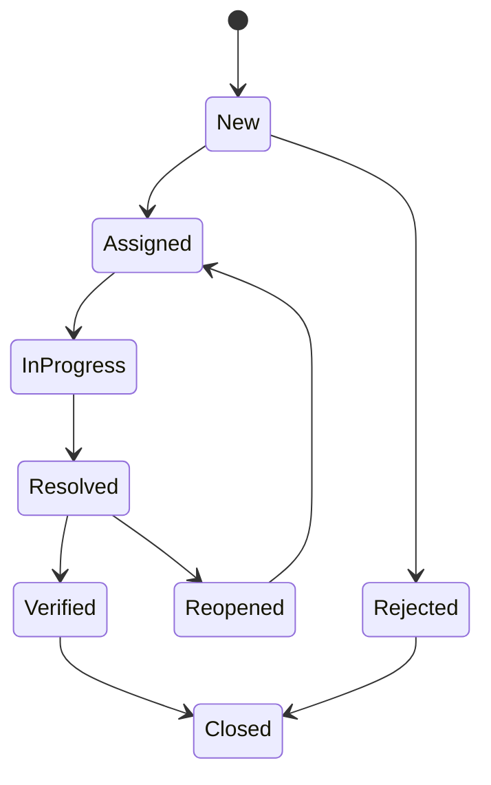
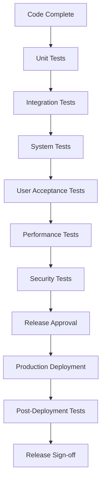

# QA Procedures

## Quality Assurance Procedures for PVT Hostel Check-In System

This document outlines the quality assurance procedures, workflows, and standards for ensuring the PVT Hostel Check-In System meets all quality requirements.

## Table of Contents

1. [QA Overview](#qa-overview)
2. [QA Team Structure](#qa-team-structure)
3. [Quality Standards](#quality-standards)
4. [Test Planning Process](#test-planning-process)
5. [Test Execution Procedures](#test-execution-procedures)
6. [Defect Management](#defect-management)
7. [Test Environment Management](#test-environment-management)
8. [Release Process](#release-process)
9. [Continuous Improvement](#continuous-improvement)

## QA Overview

### QA Mission
To ensure the PVT Hostel Check-In System delivers a reliable, secure, and user-friendly experience through comprehensive quality assurance processes.

### QA Objectives
1. **Prevent Defects**: Identify and resolve issues before release
2. **Ensure Compliance**: Meet all regulatory and security requirements
3. **Validate Requirements**: Confirm system meets business needs
4. **Maintain Quality**: Establish and maintain quality standards
5. **Continuous Improvement**: Enhance processes and procedures

### QA Scope
```yaml
Functional Testing:
  - Feature validation
  - User workflow testing
  - Integration testing
  - Regression testing
  
Non-Functional Testing:
  - Performance testing
  - Security testing
  - Usability testing
  - Accessibility testing
  - Compatibility testing
  
Process Quality:
  - Code reviews
  - Documentation reviews
  - Compliance audits
  - Process improvements
```

## QA Team Structure

### Roles and Responsibilities

#### QA Manager
```yaml
Responsibilities:
  - QA strategy development
  - Team management
  - Stakeholder communication
  - Quality metrics reporting
  - Process improvement
  
Skills Required:
  - QA leadership experience
  - Test management tools
  - Risk assessment
  - Process optimization
```

#### Senior QA Engineer
```yaml
Responsibilities:
  - Test planning and design
  - Test automation framework
  - Mentoring junior staff
  - Complex test scenarios
  - Performance testing
  
Skills Required:
  - Advanced testing techniques
  - Automation tools (Cypress, Selenium)
  - Performance testing tools
  - Security testing
  - API testing
```

#### QA Engineer
```yaml
Responsibilities:
  - Test case execution
  - Defect reporting
  - Regression testing
  - User acceptance testing
  - Documentation
  
Skills Required:
  - Manual testing
  - Basic automation
  - Test case design
  - Defect tracking
  - Browser testing
```

#### QA Analyst
```yaml
Responsibilities:
  - Requirements analysis
  - Test case writing
  - Test data preparation
  - Usability testing
  - Compliance testing
  
Skills Required:
  - Requirements analysis
  - Test case design
  - Business domain knowledge
  - Usability principles
  - Compliance standards
```

### Team Communication

#### Daily Standup
```yaml
Format: 15-minute daily meeting
Participants: All QA team members
Agenda:
  - Previous day's progress
  - Current day's plans
  - Blockers and issues
  - Cross-team dependencies
  
Tools: Slack, Microsoft Teams, or Zoom
```

#### Weekly QA Review
```yaml
Format: 1-hour weekly meeting
Participants: QA team + stakeholders
Agenda:
  - Test execution status
  - Defect metrics
  - Quality metrics
  - Risk assessment
  - Process improvements
```

## Quality Standards

### Quality Criteria

#### Functional Quality
```yaml
Acceptance Criteria:
  - All requirements implemented
  - User workflows completed successfully
  - Error handling implemented
  - Data validation working
  - Integration points tested
  
Measurement:
  - Test pass rate > 95%
  - Requirements coverage 100%
  - Critical defects = 0
  - High defects < 5
```

#### Non-Functional Quality
```yaml
Performance Standards:
  - Page load time < 2 seconds
  - Form submission < 1 second
  - Export generation < 5 seconds
  - System availability > 99.9%
  
Security Standards:
  - No security vulnerabilities
  - Data encryption implemented
  - Access controls working
  - Audit logging active
  
Usability Standards:
  - Task completion rate > 90%
  - User satisfaction > 4.0/5
  - Error rate < 5%
  - Help documentation available
```

### Quality Gates

#### Code Quality Gates
```yaml
Gate 1 - Development:
  - Unit tests pass
  - Code coverage > 80%
  - Linting passes
  - Security scan clean
  
Gate 2 - Integration:
  - Integration tests pass
  - Performance baseline met
  - Security tests pass
  - Compatibility verified
  
Gate 3 - Release:
  - All tests pass
  - User acceptance complete
  - Performance validated
  - Security approved
  - Documentation updated
```

### Quality Metrics

#### Test Metrics
```yaml
Primary Metrics:
  - Test pass rate
  - Test coverage
  - Defect density
  - Test execution time
  - Automation percentage
  
Secondary Metrics:
  - Requirements coverage
  - Code coverage
  - Risk coverage
  - Test efficiency
  - Defect leakage
```

#### Quality Dashboard
```javascript
// Quality metrics dashboard
function generateQualityReport() {
  return {
    timestamp: new Date().toISOString(),
    testExecution: {
      totalTests: 150,
      passed: 147,
      failed: 2,
      skipped: 1,
      passRate: 98.0,
      executionTime: 45 // minutes
    },
    testCoverage: {
      requirements: 100,
      code: 85.2,
      risk: 92.1,
      automation: 70.5
    },
    defectMetrics: {
      totalDefects: 12,
      critical: 0,
      high: 2,
      medium: 7,
      low: 3,
      resolved: 10,
      open: 2
    },
    qualityScore: calculateQualityScore()
  };
}
```

## Test Planning Process

### Test Planning Workflow



### Requirements Analysis

#### Requirements Review Process
```yaml
Step 1: Requirements Collection
  - Gather business requirements
  - Identify acceptance criteria
  - Document assumptions
  - Note constraints
  
Step 2: Requirements Analysis
  - Analyze completeness
  - Identify ambiguities
  - Assess testability
  - Evaluate risks
  
Step 3: Requirements Validation
  - Stakeholder review
  - Clarification sessions
  - Requirement updates
  - Final approval
```

#### Requirements Traceability
```yaml
Traceability Matrix:
  - Requirement ID
  - Test case ID
  - Test execution status
  - Defect references
  - Coverage percentage
  
Tools:
  - Excel/Google Sheets
  - JIRA with Xray
  - Azure DevOps
  - TestRail
```

### Risk Assessment

#### Risk Categories
```yaml
Technical Risks:
  - Browser compatibility
  - Performance issues
  - Security vulnerabilities
  - Data integrity
  
Business Risks:
  - User adoption
  - Regulatory compliance
  - Business continuity
  - Cost overruns
  
Operational Risks:
  - Resource availability
  - Timeline constraints
  - Environment issues
  - Third-party dependencies
```

#### Risk Mitigation Strategies
```yaml
High-Risk Items:
  - Implement early testing
  - Create additional test cases
  - Perform frequent reviews
  - Establish contingency plans
  
Medium-Risk Items:
  - Regular monitoring
  - Standard test coverage
  - Periodic reviews
  - Basic mitigation plans
  
Low-Risk Items:
  - Minimal testing
  - Standard procedures
  - Routine monitoring
  - Basic documentation
```

### Test Case Design

#### Test Case Template
```yaml
Test Case ID: TC_001
Title: Verify guest check-in with valid data
Priority: High
Category: Functional
Prerequisites:
  - System is accessible
  - Browser is compatible
  - Test data is available
  
Test Steps:
  1. Open check-in page
  2. Enter valid guest information
  3. Submit form
  4. Verify success message
  5. Check guest list
  
Expected Results:
  - Form submits successfully
  - Success message displayed
  - Guest appears in list
  - Data is correctly stored
  
Test Data:
  - First Name: John
  - Last Name: Doe
  - ID Number: AB123456
  - Room: 101
```

#### Test Case Categories
```yaml
Functional Tests:
  - Positive scenarios
  - Negative scenarios
  - Boundary conditions
  - Error handling
  
Integration Tests:
  - Data flow validation
  - System interactions
  - API testing
  - Database operations
  
System Tests:
  - End-to-end workflows
  - Performance validation
  - Security testing
  - Compatibility testing
```

## Test Execution Procedures

### Test Execution Workflow

#### Pre-Execution Checklist
```yaml
Environment Verification:
  □ Test environment accessible
  □ Application deployed
  □ Test data loaded
  □ Browser compatibility checked
  □ Network connectivity verified
  
Test Preparation:
  □ Test cases reviewed
  □ Test data prepared
  □ Tools configured
  □ Team briefed
  □ Schedule confirmed
```

#### Test Execution Process
```yaml
Step 1: Test Execution
  - Execute test cases
  - Record results
  - Capture evidence
  - Log defects
  
Step 2: Result Analysis
  - Analyze failures
  - Determine root causes
  - Assess impact
  - Plan next steps
  
Step 3: Reporting
  - Update test results
  - Generate reports
  - Communicate status
  - Schedule retests
```

### Manual Testing Procedures

#### Test Case Execution
```yaml
Execution Guidelines:
  - Follow test steps exactly
  - Record actual results
  - Capture screenshots
  - Note any deviations
  - Document observations
  
Result Recording:
  - Pass: Expected result achieved
  - Fail: Expected result not achieved
  - Blocked: Cannot execute due to issue
  - Skip: Not applicable/relevant
  - Retest: Needs re-execution
```

#### Evidence Collection
```yaml
Required Evidence:
  - Screenshots of key steps
  - Error messages
  - System logs
  - Network traces
  - Database queries
  
Evidence Standards:
  - Clear and readable
  - Properly labeled
  - Timestamped
  - Organized by test case
  - Accessible to team
```

### Automated Testing Procedures

#### Test Automation Framework
```javascript
// Base test class
class BaseTest {
  constructor() {
    this.testData = {};
    this.results = [];
  }
  
  setUp() {
    // Initialize test environment
    this.clearBrowserData();
    this.loadTestData();
  }
  
  tearDown() {
    // Clean up after test
    this.clearBrowserData();
    this.saveResults();
  }
  
  executeTest(testCase) {
    try {
      this.setUp();
      const result = this.runTestSteps(testCase);
      this.recordResult(testCase.id, 'PASS', result);
    } catch (error) {
      this.recordResult(testCase.id, 'FAIL', error.message);
      this.captureEvidence(testCase.id, error);
    } finally {
      this.tearDown();
    }
  }
}
```

#### Automated Test Execution
```yaml
Execution Schedule:
  - On code commit: Smoke tests
  - Nightly: Full regression suite
  - Weekly: Performance tests
  - Monthly: Security tests
  
Execution Environment:
  - CI/CD pipeline
  - Multiple browsers
  - Different devices
  - Various data sets
  
Result Handling:
  - Automatic result collection
  - Failure investigation
  - Retry logic
  - Notification system
```

## Defect Management

### Defect Lifecycle



### Defect Classification

#### Severity Levels
```yaml
Critical (P1):
  - System crashes
  - Data corruption
  - Security breaches
  - Complete feature failure
  
High (P2):
  - Major functionality broken
  - Performance degradation
  - Incorrect calculations
  - Workflow disruption
  
Medium (P3):
  - Minor functionality issues
  - Usability problems
  - Cosmetic issues
  - Documentation errors
  
Low (P4):
  - Suggestions
  - Enhancements
  - Typos
  - Minor cosmetic issues
```

#### Priority Levels
```yaml
Urgent:
  - Fix immediately
  - Block release
  - Stakeholder escalation
  
High:
  - Fix before release
  - May delay release
  - Management attention
  
Medium:
  - Fix in current cycle
  - Plan for fix
  - Regular tracking
  
Low:
  - Fix when possible
  - Future consideration
  - Minimal impact
```

### Defect Reporting

#### Defect Report Template
```yaml
Defect ID: DEF_001
Title: [Brief description]
Reporter: [Name]
Date: [Date reported]
Environment: [Test environment]
Build: [Build number]
Browser: [Browser version]

Severity: [Critical/High/Medium/Low]
Priority: [Urgent/High/Medium/Low]
Category: [Functional/Performance/Security/UI]

Steps to Reproduce:
1. [Step 1]
2. [Step 2]
3. [Step 3]

Expected Result:
[What should happen]

Actual Result:
[What actually happened]

Additional Information:
- Screenshots
- Error messages
- System logs
- Network traces

Workaround:
[If available]
```

#### Defect Tracking Tools
```yaml
Recommended Tools:
  - JIRA (Enterprise)
  - Azure DevOps (Microsoft)
  - GitHub Issues (Simple)
  - Bugzilla (Open source)
  - Trello (Simple projects)
  
Required Features:
  - Defect lifecycle management
  - Priority/severity tracking
  - Assignment capabilities
  - Reporting features
  - Integration with development tools
```

### Defect Triage Process

#### Triage Meeting
```yaml
Frequency: Daily for critical, weekly for others
Participants:
  - QA Manager
  - Development Lead
  - Product Owner
  - Business Analyst
  
Agenda:
  - Review new defects
  - Assess severity/priority
  - Assign to developers
  - Plan fix timeline
  - Update stakeholders
```

#### Triage Criteria
```yaml
Assessment Factors:
  - Business impact
  - Technical complexity
  - User experience impact
  - Regulatory compliance
  - Security implications
  - Cost to fix
  - Risk of fix
  
Decision Outcomes:
  - Fix immediately
  - Plan for current release
  - Defer to next release
  - Reject/Won't fix
  - Need more information
```

## Test Environment Management

### Environment Strategy

#### Environment Types
```yaml
Development Environment:
  - Purpose: Developer testing
  - Stability: Unstable
  - Data: Mock/synthetic
  - Access: Development team
  - Updates: Continuous
  
System Test Environment:
  - Purpose: QA testing
  - Stability: Stable
  - Data: Test data
  - Access: QA team
  - Updates: Controlled
  
Staging Environment:
  - Purpose: Pre-production testing
  - Stability: Production-like
  - Data: Production-like
  - Access: Limited
  - Updates: Scheduled
  
Production Environment:
  - Purpose: Live system
  - Stability: Highly stable
  - Data: Live data
  - Access: Minimal
  - Updates: Change control
```

### Environment Provisioning

#### Setup Procedures
```yaml
Environment Request:
  - Fill request form
  - Specify requirements
  - Get approval
  - Schedule provisioning
  
Provisioning Steps:
  - Allocate resources
  - Install software
  - Configure settings
  - Load test data
  - Perform validation
  
Handover Process:
  - Environment testing
  - Documentation review
  - Access provision
  - Training session
  - Sign-off
```

### Data Management

#### Test Data Strategy
```yaml
Data Categories:
  - Synthetic data: Generated
  - Masked data: Production copy
  - Subset data: Limited production
  - Static data: Fixed datasets
  
Data Requirements:
  - Representative scenarios
  - Edge cases
  - Error conditions
  - Performance volumes
  - Security testing data
```

#### Data Refresh Process
```yaml
Refresh Schedule:
  - Daily: Development
  - Weekly: System test
  - Monthly: Staging
  - As needed: Production
  
Refresh Steps:
  - Backup current data
  - Generate new data
  - Apply data masks
  - Load to environment
  - Validate data integrity
  - Notify stakeholders
```

## Release Process

### Release Workflow



### Release Criteria

#### Entry Criteria
```yaml
Code Quality:
  - All unit tests pass
  - Code coverage > 80%
  - Code review completed
  - Security scan clean
  
Test Completion:
  - All test cases executed
  - Pass rate > 95%
  - Critical defects resolved
  - Performance validated
  
Documentation:
  - User documentation updated
  - Technical documentation complete
  - Release notes prepared
  - Deployment guide ready
```

#### Exit Criteria
```yaml
Production Validation:
  - Deployment successful
  - Smoke tests pass
  - Performance monitoring active
  - No critical issues
  
Stakeholder Approval:
  - Business sign-off
  - Technical sign-off
  - Security approval
  - User acceptance
  
Readiness Confirmation:
  - Support team trained
  - Monitoring configured
  - Rollback plan ready
  - Communication sent
```

### Release Testing

#### Pre-Release Testing
```yaml
Test Types:
  - Regression testing
  - Performance testing
  - Security testing
  - Compatibility testing
  - User acceptance testing
  
Test Scope:
  - Core functionality
  - New features
  - Integration points
  - Critical workflows
  - Error scenarios
```

#### Post-Release Testing
```yaml
Smoke Testing:
  - Critical path validation
  - Key functionality check
  - Performance baseline
  - Security verification
  
Monitoring:
  - Error rate monitoring
  - Performance metrics
  - User feedback
  - System stability
  
Validation Period:
  - 24 hours: Initial monitoring
  - 1 week: Stability confirmation
  - 1 month: Performance validation
```

## Continuous Improvement

### Process Improvement

#### Improvement Cycle
```yaml
Identify:
  - Process bottlenecks
  - Quality issues
  - Efficiency gaps
  - Team feedback
  
Analyze:
  - Root cause analysis
  - Impact assessment
  - Solution options
  - Cost-benefit analysis
  
Implement:
  - Pilot testing
  - Team training
  - Process updates
  - Tool improvements
  
Monitor:
  - Effectiveness measurement
  - Team feedback
  - Metric tracking
  - Continuous adjustment
```

#### Metrics Analysis
```yaml
Quality Metrics:
  - Defect trends
  - Test effectiveness
  - Coverage analysis
  - Customer satisfaction
  
Process Metrics:
  - Cycle time
  - Resource utilization
  - Cost per defect
  - Automation percentage
  
Team Metrics:
  - Productivity
  - Skill development
  - Job satisfaction
  - Knowledge sharing
```

### Knowledge Management

#### Documentation Standards
```yaml
Required Documents:
  - Test plans
  - Test cases
  - Test results
  - Defect reports
  - Process procedures
  - Best practices
  - Lessons learned
  
Documentation Reviews:
  - Monthly: Process updates
  - Quarterly: Document review
  - Annually: Complete overhaul
  - As needed: Immediate updates
```

#### Training Program
```yaml
New Team Members:
  - QA fundamentals
  - Tool training
  - Process overview
  - System knowledge
  - Mentoring program
  
Ongoing Training:
  - Monthly skill sessions
  - Quarterly tool updates
  - Annual process review
  - Industry conferences
  - Certification programs
```

### Innovation and Automation

#### Automation Strategy
```yaml
Automation Goals:
  - Reduce manual effort
  - Improve accuracy
  - Increase coverage
  - Enable faster feedback
  
Automation Areas:
  - Test execution
  - Result reporting
  - Environment management
  - Data generation
  - Defect tracking
```

## Conclusion

These QA procedures ensure consistent, high-quality testing practices for the PVT Hostel Check-In System. Regular review and improvement of these procedures maintains their effectiveness and relevance.

### Key Success Factors
1. **Clear Standards**: Well-defined quality criteria
2. **Consistent Processes**: Standardized procedures
3. **Team Collaboration**: Effective communication
4. **Continuous Learning**: Regular skill development
5. **Process Improvement**: Regular optimization
6. **Tool Support**: Appropriate automation
7. **Stakeholder Engagement**: Business involvement

---

*Last Updated: January 2025*  
*Next Review: April 2025*  
*Owner: QA Team*